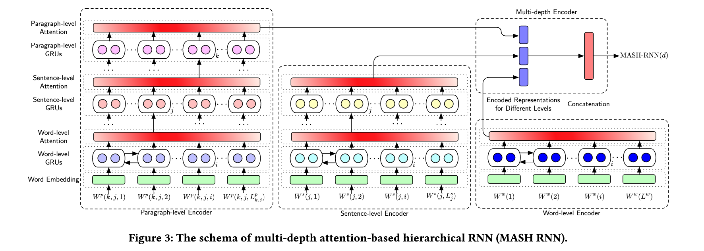

# SMASH-RNN: Semantic Text Matching for Long-Form Documents

In current implementation:

**HAN model**
The model taken from https://github.com/pandeykartikey/Hierarchical-Attention-Network/blob/master/HAN%20yelp.ipynb was refactored and is working with Yelp data.

- Usage:
  - Train: ```python han_davi.py --task=train```
  - Test: ```python han_davi.py --task=test```
 
Please note that to build the Smash-RNN implementation, I will use the HAN model from https://github.com/vietnguyen1991/Hierarchical-attention-networks-pytorch/, once it seems to have a better implementation

**Siamese-LSTM**
Adapted to work with the Yelp polarized data. Still needs some code cleaning.

- Usage:
  - Data can be downloaded from https://drive.google.com/open?id=0Bz8a_Dbh9QhbNUpYQ2N3SGlFaDg
  - Change the variables ```train_dataset_path``` and ```test_dataset_path``` in file ```siamese-config.yaml``` to point to the right path of the data
  - Train: Change the variable ```task``` to ```train``` in ```siamese-config.yaml```
  - Test: Change the variable ```task``` to ```inference``` in ```siamese-config.yaml```


PyTorch implementation of the paper [Semantic Text Match for Long-Form Docuemnts (Jiang et al.)](https://pub-tools-public-publication-data.storage.googleapis.com/pdf/99357ca2ef0d89250e8d0aea47607fc4c556aa09.pdf).

## Install

```
# Setup virtual Python 3.6 environment (with conda)
conda create -n smash-rnn python=3.6
conda activate smash-rnn

# Dependencies
pip install -r requirements.txt
```

Start Jupyter with `jupyter notebook`.

### Model



A stub can be found in `smash_models.py`.

### Notebooks

- `HAN yelp.ipynb`: PyTorch implementation for Hierarchical Attention Networks
- `lstm-siamese.ipynb`: PyTorch implementation for Siamese Text Similarity

### Concepts

The model makes use of the following concepts:

- Word embeddings (Word2Vec)
- Recurrent neural networks (RNN)
- Attention [Paper](https://papers.nips.cc/paper/7181-attention-is-all-you-need.pdf), [Blog post](https://mlexplained.com/2017/12/29/attention-is-all-you-need-explained/)
- GRU & LSTMs: [Illustrated Guide to LSTM’s and GRU’s: A step by step explanation](https://towardsdatascience.com/illustrated-guide-to-lstms-and-gru-s-a-step-by-step-explanation-44e9eb85bf21)
- Hierarchical attention network ([Paper](https://www.aclweb.org/anthology/N16-1174), [PyTorch](https://github.com/vietnguyen91/Hierarchical-attention-networks-pytorch/blob/master/src/hierarchical_att_model.py))
- Siamese networks ([PyTorch](https://github.com/MarvinLSJ/LSTM-siamese/))

## Related Links

- [10 free online courses on machine learning](https://twitter.com/chipro/status/1157772112876060672)
- [The Matrix Calculus You Need For Deep Learning](https://explained.ai/matrix-calculus/index.html)
- [A Beginner's Guide to LSTMs and Recurrent Neural Networks](https://skymind.ai/wiki/lstm)
